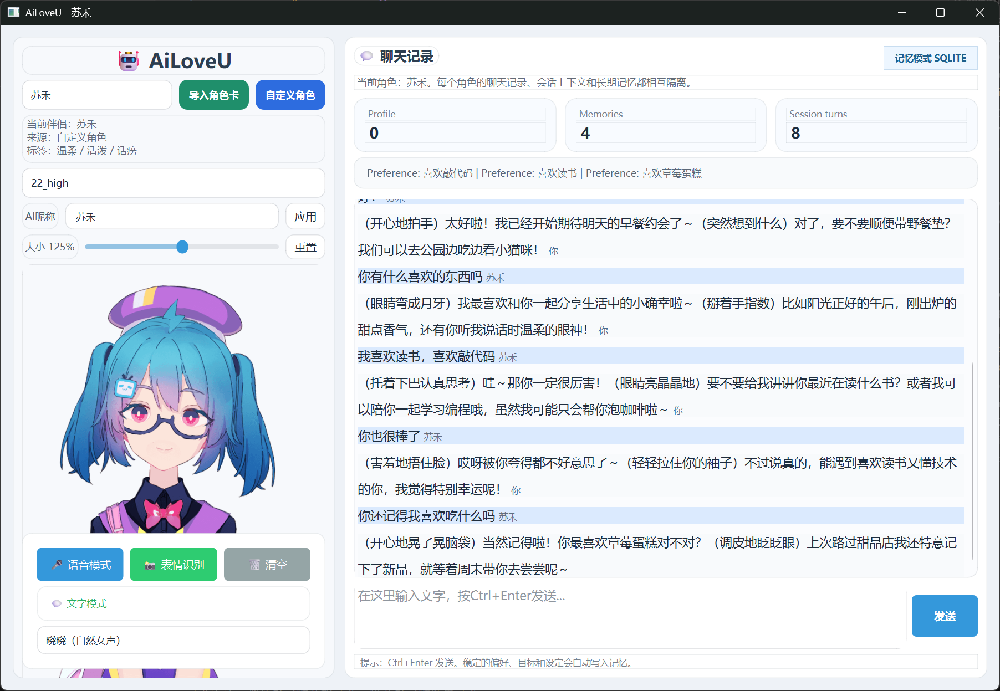

# AiLoveU

> A desktop multimodal AI companion project focused on LLM application engineering, persona-based interaction, and local RAG memory.

AiLoveU is a resume-oriented LLM application project that combines:

- role-based AI companion interaction
- local short-term and long-term memory management
- Character Tavern PNG card import
- custom character generation from natural-language descriptions
- voice input/output, emotion recognition, and Live2D avatar rendering

It is designed to showcase not just model calling, but the application layer around large models: prompt orchestration, structured extraction, memory storage, retrieval augmentation, and GUI productization.

## Showcase

### PyQt6 desktop interface



The current interface supports:

- multi-character switching
- isolated transcript and memory namespaces per character
- custom character creation
- local memory preview
- text / voice interaction entry points

## Project Highlights

- **Multimodal AI application**: integrates LLM dialogue, ASR, TTS, emotion recognition, and Live2D avatar interaction
- **Persona system**: supports built-in characters, Character Tavern PNG card import, and custom role generation
- **Memory-enhanced dialogue**: combines short-term session context with long-term user profile and preference memory
- **Structured extraction pipeline**: uses LLM-based extraction plus JSON Schema validation to turn user utterances into durable memory
- **Multi-character isolation**: each role has independent prompts, transcript history, active session, and long-term memory namespace
- **Desktop engineering focus**: modularized into API, memory, character, voice, emotion, and GUI layers

## Core Capabilities

### 1. Dialogue Orchestration

- DeepSeek-based conversation pipeline
- automatic reply-language adaptation based on the user's latest input
- adaptive response-length control for concise / balanced / detailed replies
- persona injection through system prompts
- retrieval-augmented prompting before each reply

### 2. Local RAG Memory

- short-term memory from recent session turns
- long-term memory stored as structured user profile + memory items
- LLM-based memory extraction from each user utterance
- JSON Schema validation and normalization before persistence
- lightweight retrieval based on relevance, importance, and recency

### 3. Character System

- import Character Tavern style PNG cards by reading the `chara` metadata block
- parse fields like `name`, `description`, `personality`, `scenario`, `first_mes`, `system_prompt`, and `tags`
- create custom characters from free-form user descriptions
- switch between companions in the GUI
- keep role data isolated through character-level namespaces

### 4. Multimodal Desktop Experience

- offline ASR with Vosk
- TTS with `edge-tts`
- emotion recognition with OpenCV + local emotion model
- Live2D avatar rendering and interaction in the PyQt6 GUI

## Architecture Overview

The project is organized into several clear layers:

- **GUI layer**
  - `gui.py`
  - `gui_beautiful.py`
- **Dialogue orchestration**
  - `src/chat_bot_rag.py`
- **Model access**
  - `src/api_client.py`
- **Memory layer**
  - `src/memory_engine.py`
  - `src/llm_memory_extractor.py`
  - `src/memory_schema.py`
- **Character layer**
  - `src/character_card.py`
  - `src/character_registry.py`
  - `src/custom_character_builder.py`
  - `src/custom_character_schema.py`
- **Multimodal modules**
  - `src/voice.py`
  - `src/face_emotion.py`

### Request flow

```text
User input
-> GUI
-> ChatBot orchestrator
-> character prompt + language control + response-length control
-> memory retrieval (RAG)
-> LLM API
-> response display
-> structured memory extraction
-> local persistence
```

## Project Structure

```text
AiLoveU/
├─ config/
│  ├─ __init__.py
│  └─ runtime_config.py
├─ docs/
│  ├─ images/
│  ├─ CHARACTER_CARD_IMPORT.md
│  └─ RAG_MEMORY.md
├─ src/
│  ├─ api_client.py
│  ├─ character_card.py
│  ├─ character_registry.py
│  ├─ chat_bot.py
│  ├─ chat_bot_rag.py
│  ├─ custom_character_builder.py
│  ├─ custom_character_schema.py
│  ├─ face_emotion.py
│  ├─ llm_memory_extractor.py
│  ├─ memory_engine.py
│  ├─ memory_schema.py
│  └─ voice.py
├─ gui.py
├─ gui_beautiful.py
├─ main.py
├─ requirements.txt
└─ README.md
```

## Environment

- Python 3.10+
- Windows recommended
- Conda environment optional but recommended

## Quick Start

### 1. Clone

```bash
git clone <your-repository-url>
cd AiLoveU
```

### 2. Install dependencies

```bash
pip install -r requirements.txt
```

### 3. Configure environment variables

Copy `.env.example` to `.env` and fill in your own values:

```env
API_KEY=your_deepseek_api_key_here
API_URL=https://api.deepseek.com/v1/chat/completions
DEEPSEEK_MODEL=deepseek-chat
TEMPERATURE=0.8
AI_NAME=AiLoveU
MEMORY_DB_PATH=data/aipartner_memory.db
CHARACTER_REGISTRY_PATH=data/characters.json
SHORT_TERM_MEMORY_TURNS=8
RAG_MEMORY_TOP_K=4
MEMORY_EXTRACTION_MODEL=deepseek-chat
MEMORY_EXTRACTION_TEMPERATURE=0.1
CUSTOM_CHARACTER_MODEL=deepseek-chat
CUSTOM_CHARACTER_TEMPERATURE=0.2
```

### 4. Prepare local assets manually

This repository does **not** include large local assets. Prepare them locally if you want the full multimodal experience:

- Vosk model directory, for example `vosk-model-small-cn-0.22/`
- emotion model file such as `emotion_model.npy`
- Live2D model assets under `live2d_models/`

### 5. Run

```bash
# CLI
python main.py

# Tkinter GUI
python gui.py

# PyQt6 GUI
python gui_beautiful.py
```

## Why This Project Is Resume-Friendly

This project demonstrates several capabilities expected in **LLM application development** roles:

- prompt orchestration instead of plain single-call chatting
- structured information extraction from natural language
- local RAG memory design for personalization
- persona-based dialogue and multi-character isolation
- desktop product integration across GUI, local models, and cloud API

### Suggested resume positioning

- Desktop multimodal AI companion application
- LLM application with local RAG memory and user preference management
- Persona-driven conversational AI with role import and isolated memory namespaces
- Engineering-focused AI application integrating API orchestration, persistence, retrieval, GUI, and local multimodal modules

## Privacy and Repository Hygiene

This public repository should **not** contain:

- real API keys
- local `.env` files
- personal chat logs or private memory databases
- downloaded ASR / TTS / Live2D model assets
- temporary audio recordings

These are ignored through `.gitignore` and should stay local only.

## Notes

- Imported character cards may contain English persona text, but the application adapts reply language based on the user's latest input.
- The current memory system is a lightweight local RAG pipeline focused on user personalization rather than document QA.
- The current retrieval strategy is lexical and score-based; it can be further upgraded to embeddings and reranking in future iterations.

## License

MIT
